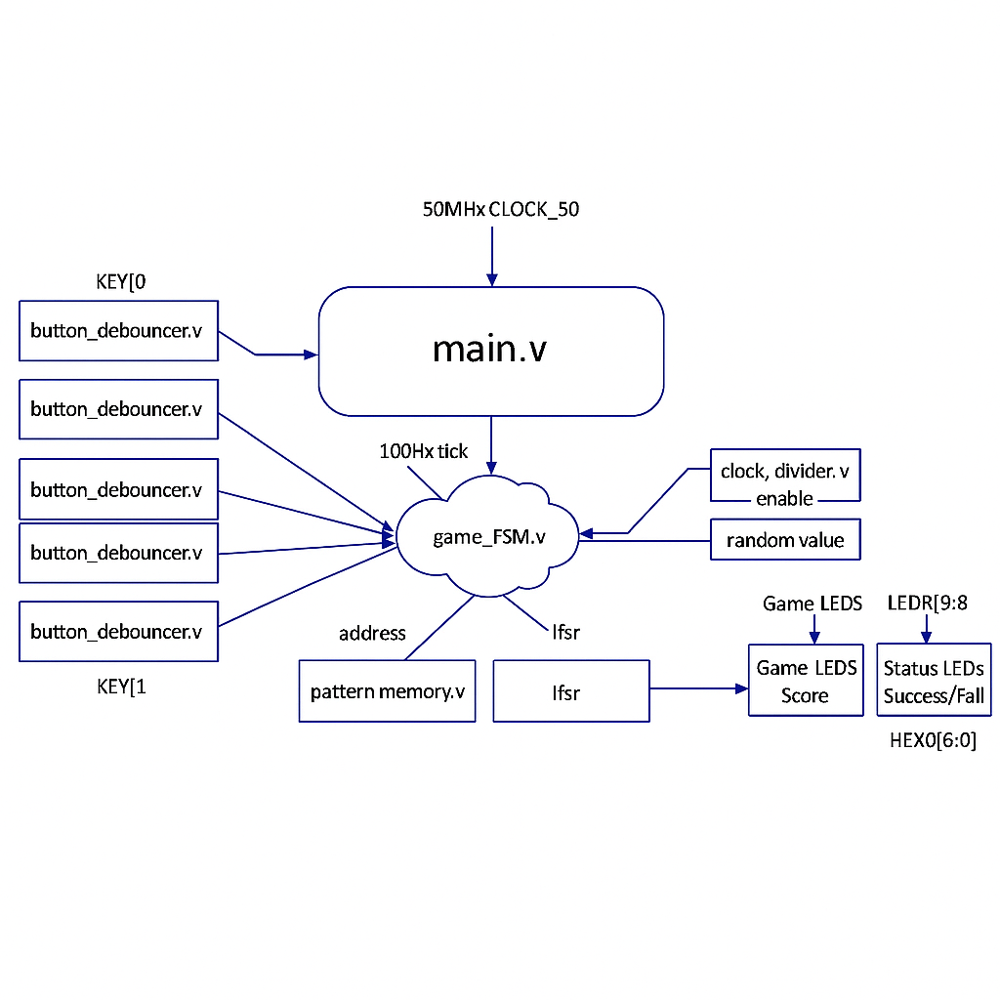
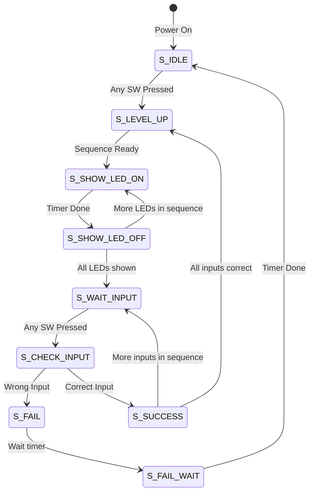

# FPGA Simon Memory Game

Simon's Game is an old memory game which was first developed in 1980s which we rebuilt from the very start in Verilog. In this project we implemented the full game logic on an FPGA, complete with random sequence generation, a growing-difficulty level, score tracking and I/O handling for buttons and LEDs.

---

## Table of Contents

1. [About the Project](#about-the-project)
2. [System Architecture](#system-architecture)
3. [Features](#features)
4. [How to Build](#how-to-build)
5. [How to Play](#how-to-play)
6. [Contributing](#contributing)
7. [Contact](#contact)

---

## About the Project

This is a final project for an Advanced Digital Design course in which we showed the use of Finite State Machines, memory and modular design in hardware.

The game is built with Verilog and runs on an FPGA. It has:
- **Random sequence generation** using a Linear Feedback Shift Register (LFSR).
- **Growing difficulty** as the game progresses.
- **Score tracking** displayed on a 7-segment display.
- **button debouncing** for good input handling.
- Modular design for easy understanding and buliding easily.

---

## System Architecture



The design that we used is fully modular with all components instantiated and connected in the 'main.v' module.


Summary of the main modules:

### **`main.v`**
- We can say that this is the "motherboard" of the project.
- It instantiates all other modules and connects them to the FPGA pins.
- (Rather) has no logic of its own.

---

### **`game_fsm.v`**

- We can call this section the "brain" of the game that is implemented as a Finite State Machine.
- Uses a 100Hz tick from the clock divider.
- Manages game states:
  - 'S_IDLE', 'S_LEVEL_UP', 'S_SHOW_LED_ON', 'S_SHOW_LED_OFF', 'S_WAIT_INPUT', 'S_CHECK_INPUT', 'S_SUCCESS', 'S_FAIL', 'S_FAIL_WAIT'
- Coordinates other modules:
  - Tells the LFSR when to generate a new number.
  - Writes and reads data from 'pattern_memory'.
  - Controls the game LEDs and 7-segment display.
  - Listens for pulses from the 'button_debouncer'.

---

### **`clock_divider.v`**
- This part is the "heartbeat" of the game.
- It divides the 50MHz FPGA clock down to 100Hz which means one pulse every 10ms in order to make it visible for human eye.

---

### **`button_debouncer.v`**
- This is actually our "input filter."
- It cleans noisy button signals and outputs a single clean pulse per button press.
- Four instances are used in 'main' to handle all player inputs.

---

### **`pattern_memory.v`**
- As its name suggests, this is the "long-term memory" of the game.
- It's a 64-entry, 2-bit wide RAM that stores the sequence of colors.
- FSM writes new random colors during `S_LEVEL_UP` and reads the sequence during `S_SHOW_LED_ON` and `S_CHECK_INPUT`.

---

### **`lfsr.v`**
- The "randomizer."
- This is an 8bit Linear Feedback Shift Register or simply LFSR that generates random sequences.
- FSM uses the current 2bit value during `S_LEVEL_UP` to select the next color.

---

### **`seven_seg.v`**
- Display
- It converts a 4bit score into signals to drive the 7segment HEX0 display.

---

## Features

- **Random Sequence Generation**: Uses an 8 bit Linear Feedback Shift Register to generate a new random color for each level.
- **Growing Difficulty**: The pattern sequence adds one new color every round.
- **Score Tracking**: Shows the current level on a 7 segment HEX0 display.
- **Full I/O Handling**:
  - Input: Reads from physical switches.
  - Debouncing: Includes `button_debouncer` module for without noise input.
  - Output: Drives 4 game LEDs, 2 status LEDs which are Success or Fail and the 7-segment display.
- **Game States**: Managed by a full Finite State Machine with states like `IDLE`, `SHOW_PATTERN`, `WAIT_INPUT`, `SUCCESS` and `FAIL`.

---

## How to Build

Follow these steps to build and run the project on an FPGA:

1. Clone this repository:
   ```bash
   git clone https://github.com/AMB0000/Simon-s-Game.git
2. **Open Intel Quartus Prime**:  
   Launch the Quartus Prime software and create a new project.

3. **Add `.v` files to the project**:  
   Include all Verilog files (`main.v`, `game_fsm.v`, ...) in the project.

4. **Set the top-level entity**:  
   - Right-click on `main.v` in the "Files" list.  
   - Select **"Set as Top-Level Entity"**.

5. **Pin Assignment**:  
   Open the **Pin Planner** (Assignments > Pin Planner) and assign the following FPGA pins based on your board's configuration:  
   - **CLOCK_50**: Connect to your board's 50MHz clock pin.  
   - **KEY[0]**: Assign to a pushbutton  
   - **SW[3:0]**: Assign to four slide switches 
   - **LEDR[9:0]**: Assign to ten red LEDs  
   - **HEX0[6:0]**: Assign to the segments of a 7-segment display

6. **Compile the project**:  
   Start the compilation by going to **Processing > Start Compilation** in Quartus.

7. **Program the FPGA board**:  
   Use the Quartus to load the compiled `.sof` file onto FPGA board.

---

## How to Play

When the project is loaded onto the FPGA, follow these steps to play the game:

1. **Reset the game**:  
   Press `KEY[0]` to reset the game. The score (which will be shown on the HEX0 7-segment display) will reset to 0.

2. **Start the game**:  
   Flip any of the four switches `SW[3:0]` to begin the game.

3. **Level 1**:  
   The score will update to 1 and one of the game LEDs which are `LEDR[3:0]` will flash to indicate the first color in the sequence.

4. **Your turn**:  
   Flip the switch corresponding to the LED that flashed.

5. **Success**:  
   - If you provide the correct input:  
     - `LEDR[8]` which is the Success LED will flash.  
     - The score will increase by 1.  
     - The game will then replay the sequence and it will add one new color to the pattern.

6. **Repeat**:  
   Continue watching and repeating the growing sequence as long as success.

7. **Failure**:  
   - If you flip the wrong switch:  
     - `LEDR[9]` which is the Fail LED will flash.  
     - All game LEDs will light up.  
     - The score will reset to 0, and the game will return to IDLE mode and it will wait for you to start again.

---

## Contributing

Contributions are welcome! Method of how you can contribute to this project:

1. **Fork the repository**:  
   Click the "Fork" button on this repository to create a copy on your GitHub account.

2. **Create a new branch**:  
   Create a branch for your feature or bug fix:  
   ```bash
   git checkout -b feature/YourFeature
3. **Make your changes:**
   Implement your feature or fix the bug in your local repository.
4. **Commit your changes:**
   Write a clear and concise commit message:
    ```bash
   git commit -m "Add YourFeature"
5. **Push to your branch:**
   Push your changes to your GitHub fork:
   ```bash
   git push origin feature/YourFeature
5. **Push to your branch:**
   Push your changes to your GitHub fork:
   ```bash
   git push origin feature/YourFeature
 6. **Open a pull request:**
   Go to the original repository on GitHub and open a pull request


## Conclusion 

Here is a revised conclusion that includes the fact that the project is not fully complete **and** that you ran into problems with your DE10-Lite board results:

---

## **Conclusion**

Although the Simon Game project was not 100% successful, the work done so far has helped establish a strong foundation for a fully hardware-based memory game on the DE10-Lite FPGA. Core modules such as the clock divider, LFSR, button debouncers, and parts of the game FSM have been designed and tested in simulation, giving a solid understanding of the system’s overall behavior. The architecture is clearly laid out, and the main structure of the game logic is already in place.

However, I ran into issues when testing the design on the actual DE10-Lite board. Some modules did not behave the same way on hardware as they did in simulation, and certain inputs or outputs—such as the buttons, LEDs, or HEX display—did not respond as expected. These hardware-level problems prevented me from fully integrating and validating the complete game. Debugging will require additional testing, checking pin assignments, reviewing clocking behavior, and ensuring stable input signals.

Even though the final game is not yet finished, the progress made throughout the project has strengthened my understanding of Verilog, FSM design, and FPGA-based digital systems. With more time to troubleshoot the hardware issues and refine the remaining modules, the project can be completed and made fully functional on the DE10-Lite platform.


## Contact

If you have any questions or feedback please tell me:
- Name: Ali Behbehani
- Email: ali.behbehani@du.edu
- GitHub: https://github.com/AMB0000
